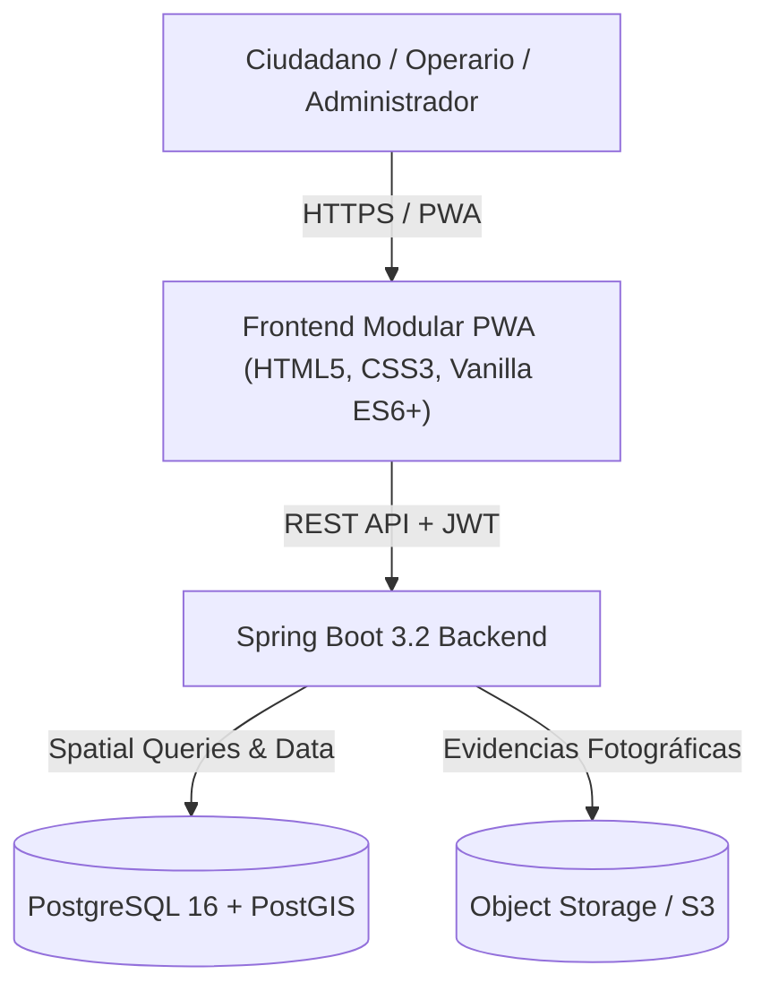

# Arquitectura Técnica: Plataforma Municipal Civitas

## 1. Visión General y Principios de Diseño
**Civitas** es una plataforma cívica digital diseñada para conectar ciudadanos y ayuntamientos de manera transparente, segura y eficiente. Permite registrar incidencias en la vía pública en 4 pasos ("*Detectar → Ubicar → Informar → Seguir*"), votar propuestas vecinales en presupuestos participativos y dotar al personal municipal de un panel de control con métricas en tiempo real.

---

## 2. Diagrama de Arquitectura

---

## 3. Algoritmo de Detección de Duplicados (<50m)

Para evitar duplicidad de intervenciones técnicas en un mismo bache, farola o fuga de agua:
1. Al fijar el punto GPS o la categoría, se calcula la distancia Haversine (en frontend) o mediante la función geoespacial `ST_DWithin` en PostGIS (en backend):
   $$\text{Distancia} \le 50\text{ metros} \quad \land \quad \text{Categoría Coincidente}$$
2. Si se detecta una incidencia activa en ese radio, la aplicación ofrece al ciudadano sumarse al reporte ("*A mí también me afecta*"), incrementando la prioridad sin generar registros duplicados para los operarios.

---

## 4. Algoritmo de Priorización Automática Ponderada

El sistema calcula una puntuación de prioridad dinámica (0 a 100 puntos):

$$\text{Prioridad} = (U \times 0.40) + (C_R \times 0.30) + (A \times 0.20) + (Z_S \times 0.10)$$

Donde:
- **$U$ (Urgencia declarada)**: Urgente (100), Alta (75), Media (45), Baja (20).
- **$C_R$ (Riesgo intrínseco de categoría)**: Red de Agua / Tráfico (80-100), Alumbrado / Vías (60), Mobiliario (20-40).
- **$A$ (Afectados / Adhesiones ciudadanas)**: $\min(\text{Adhesiones} \times 10, 100)$.
- **$Z_S$ (Zona Sensible)**: Entornos escolares, centros de salud o alta densidad peatonal (50-100).

---

## 5. Matriz de Roles y Permisos (RBAC)

| Funcionalidad | Ciudadano (`ROLE_CITIZEN`) | Operario (`ROLE_EMPLOYEE`) | Admin Municipal (`ROLE_MUNICIPAL_ADMIN`) | SuperAdmin (`ROLE_SUPERADMIN`) |
|---|:---:|:---:|:---:|:---:|
| Reportar y seguir incidencias | ✅ | ✅ | ✅ | ✅ |
| Votar y crear sugerencias | ✅ | ✅ | ✅ | ✅ |
| Ver asignaciones de departamento | ❌ | ✅ | ✅ | ✅ |
| Cambiar estado a "En Proceso" / "Resuelta" | ❌ | ✅ | ✅ | ✅ |
| Reasignar departamentos y operarios | ❌ | ❌ | ✅ | ✅ |
| Responder propuestas vecinales | ❌ | ❌ | ✅ | ✅ |
| Auditoría global y gestión multi-ayuntamiento | ❌ | ❌ | ❌ | ✅ |

---

## 6. Seguridad y Protección de Datos (RGPD & OWASP)
1. **Minimización de datos**: En los listados y mapas públicos no se muestran nombres completos, emails ni números de teléfono de los ciudadanos informantes.
2. **Sanitización XSS**: Todo texto de entrada pasa por un filtro de codificación de entidades HTML.
3. **Anti-Bot**: Validación combinada mediante trampa *Honeypot* invisible y Captcha matemático accesible.
4. **Hashing de Contraseñas**: Algoritmo `BCrypt` con factor de coste 12.
5. **Trazabilidad Inmutable**: Registro de auditoría con sello temporal, usuario responsable, IP y acción realizada.
